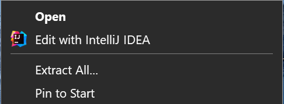
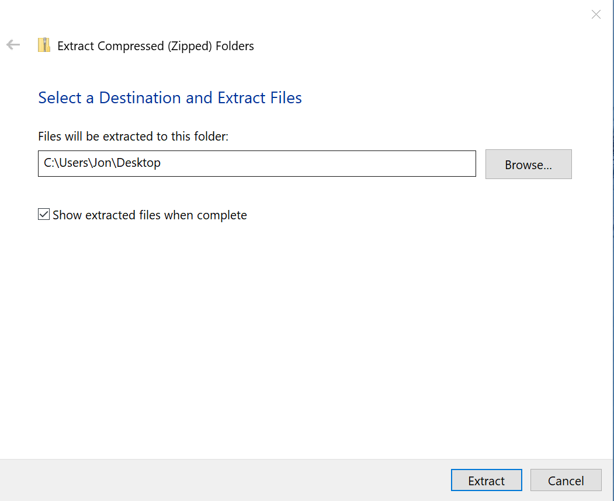
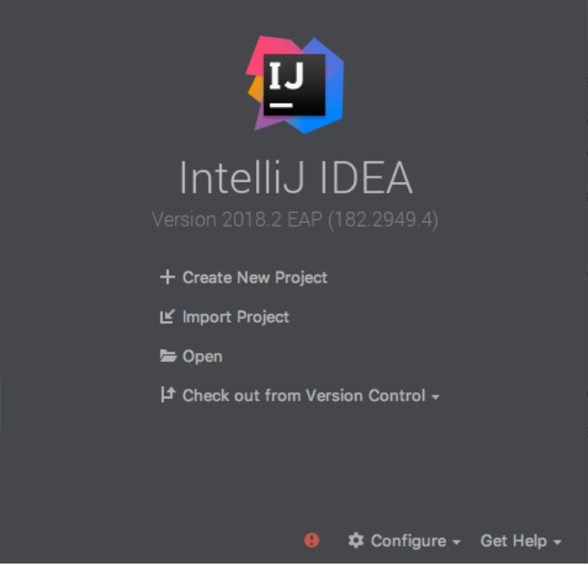
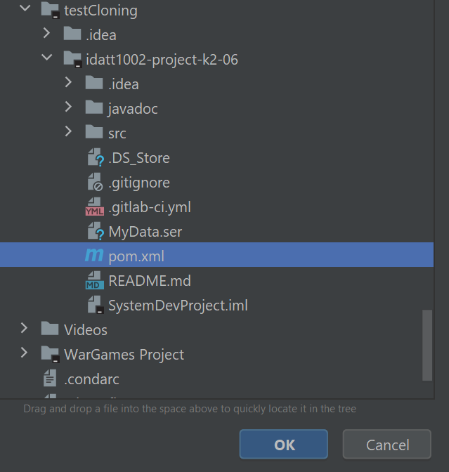
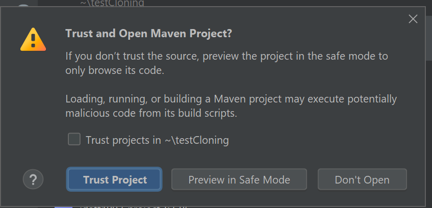
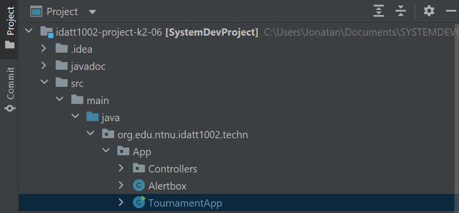
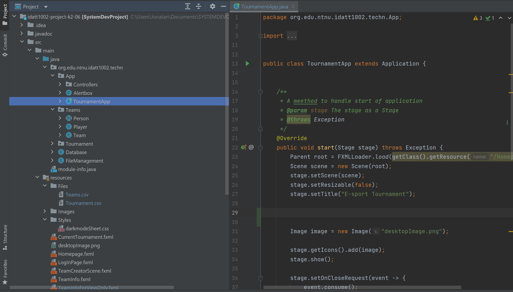
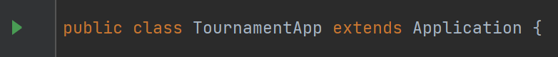
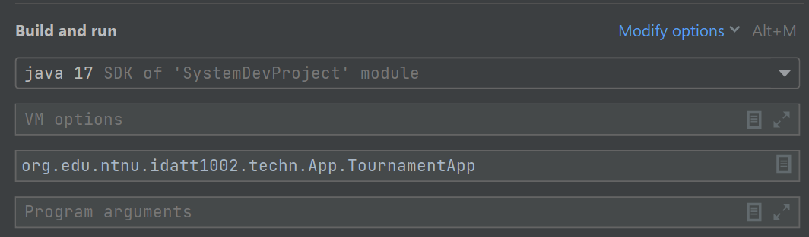

# Tournament Creator App
------------------------------------------------------------------------------

The tournament creator app is an app made to help structure and make e-sport tournaments. In the app it is possible to add teams and players in the teams. 
When this is done you can create tournament with the teams of your choice from a range of 2 to 16 total teams.
The app also has a view only mode for people to keep up with the tournament.

The app is made by:

K2-06, a group which is a part of the firm Technico

**_Authors in Cohort 2 Group 6_**

* Jonatan

* Stian

* Aleksander

* Balder

* Vilhjalmur

------------------------------------------------------------------------------

## Contents
[[_TOC_]]


------------------------------------------------------------------------------
## Installation

------------------------------------------------------------------------------
### Step 1 Download and run Java SE Development Kit

Download and run Java SE Development Kit [**here**](https://www.oracle.com/java/technologies/downloads/#java17)


------------------------------------------------------------------------------
### Step 2 Download Jar file

Download our Jar file [here](https://drive.google.com/file/d/1EdFrEnmTRAx5fDkqy8svZm3b3jybm9LV/view?usp=sharing)

------------------------------------------------------------------------------
### Step 3 Save and remember the location of the Jar file

When you have downloaded the Zip file
Save it and remember the location
Right click it the zip file and press extract all
Like shown in picture below:



After you have clicked extract all, a pop-up like this should show:



Now you need to choose where you want the program to be stored


------------------------------------------------------------------------------
### Step 4 Run Jar file

When you have chosen where you want the program to be stored, open the file.
When the file is open, double click this application:


For everytime you want to open the application just repeat step 4

If you dont want to download and run JAR file just follow the steps below:

------------------------------------------------------------------------------
### Step 1 Download java 17

Press the link [**here**](https://www.oracle.com/java/technologies/downloads/#java17) and download java 17.

------------------------------------------------------------------------------
### Step 2 Download intelliJ (or other IDE with maven support)


Press the link [**here**](https://www.jetbrains.com/idea/download/#section=windows) and download Intellij. Both ulimate and community version will work.

You can also use another IDE if you prefer another one.

------------------------------------------------------------------------------
### Step 3 Clone/Download project


**With Git**:

Download git [**here**](https://git-scm.com/) if you haven't already

Open a new folder and run the following command:
```
git clone https://gitlab.stud.idi.ntnu.no/systemutvikling-k02-6/idatt1002-project-k2-06.git
```

Using the app Git CMD after git download for cloning of project will work fine as well.


**Without Git** do this:

Head over to the front page and press the download button of the repository

(Download as a zip-file is recommended)

------------------------------------------------------------------------------
### Step 4 Open project in chosen IDE

When opening IntelliJ IDEA this is the starting page:



Press "Open or Import" and navigate to the folder created in step 3.

When you have located the folder it should look like this:



Now press the pom.xml and hit **OK**.

When that is done a pop up like this should show up:


Press open as project.

After that, a pop-up like this should show up:



Press **Trust Project**

------------------------------------------------------------------------------
### Step 5 Run program

1. Head over to project, and find and press class TournamentApp under package "App" as shown in picture below:



2. When this is done the class will pop up over here on the right side of the screen:



3. Now press the green play button located to the left as shown in the picture below:




4. Hit Run"TournamentApp.main()"

------------------------------------------------------------------------------

# Troubleshooting

NB:
If there is any problems with running the program.

Head over to [**here**](https://openjfx.io/openjfx-docs/#install-java) and download latest version of javafx.

When the download is done you need to unpack the zip file and save it a place your remember.
As shown in step 5 you need to locate class TournamentApp under package "App" as shown in the picture. Right click this class and hit More Run/Debug -> More run configuration.

Locate VM options.



(If VM options is not there just hit modify options and add VM options)

In VM options:
````
--module-path "your-path-to-javaFX-lib" --add-modules javafx.controls,javafx.fxml"
````
Hit apply and then ok. Try to run the application again.


------------------------------------------------------------------------------

# How to use project for future development

**_Needed to use project_**
* [**Git(Not necessary)**](https://git-scm.com/)
* [**Java 17**](https://www.oracle.com/java/technologies/downloads/#java17)
* [**IntelliJ IDEA**](https://www.jetbrains.com/idea/download/#section=windows)

Other IDE wiht maven supports also works but IntelliJ IDEA is highly recommended

**How to get source code**

**With Git** write this in an new empty repository:
|-----------------------------------------------------------------
git clone https://gitlab.stud.idi.ntnu.no/systemutvikling-k02-6/ idatt1002-project-k2-06.git

**Without Git** do this:
|-----------------------------------------------------------------
Head over to the front page and press the download button of the repository


When the source code is opened in chosen IDE, please run maven commands:
compiler:compile and javafx:run

------------------------------------------------------------------------------

# Documentation

**_Relevent information about the project:_**
* [**Wiki Page**](https://gitlab.stud.idi.ntnu.no/systemutvikling-k02-6/idatt1002-project-k2-06/-/wikis/home)
* [**JavaDoc for project**](https://systemutvikling-k02-6.pages.stud.idi.ntnu.no/idatt1002-project-k2-06/idatt1002.project.k2/org/edu/ntnu/idatt1002/techn/App/package-summary.html)


------------------------------------------------------------------------------


